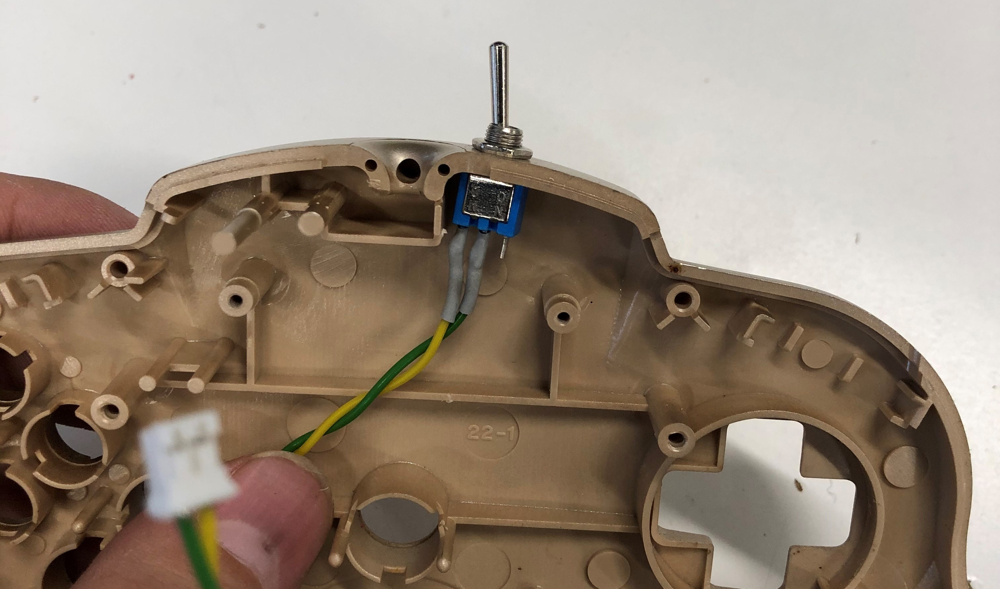
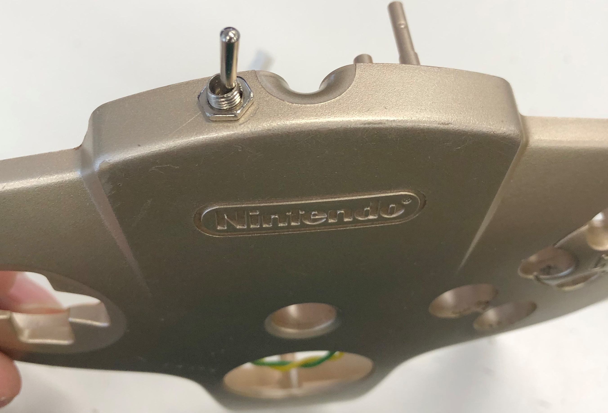
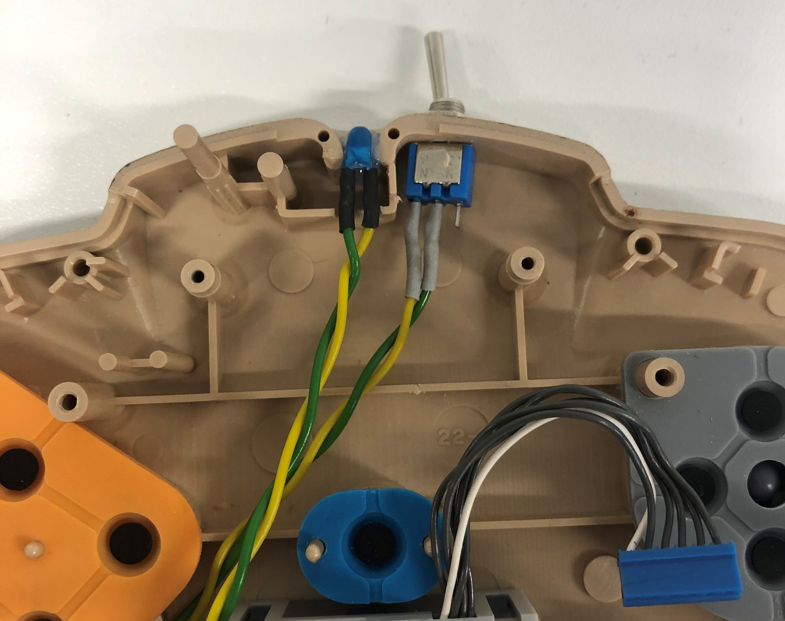
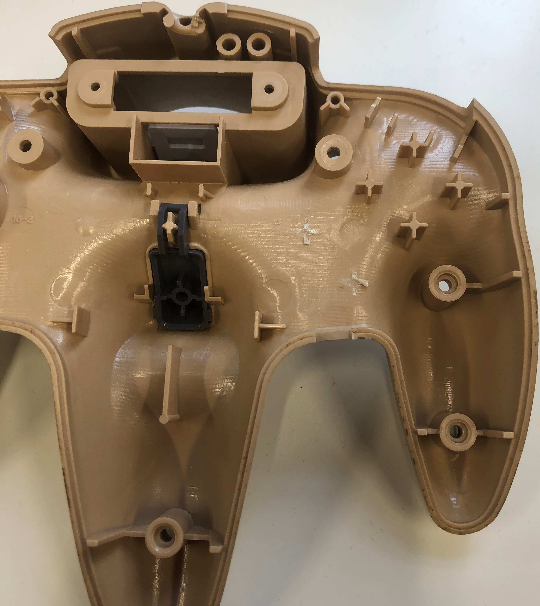
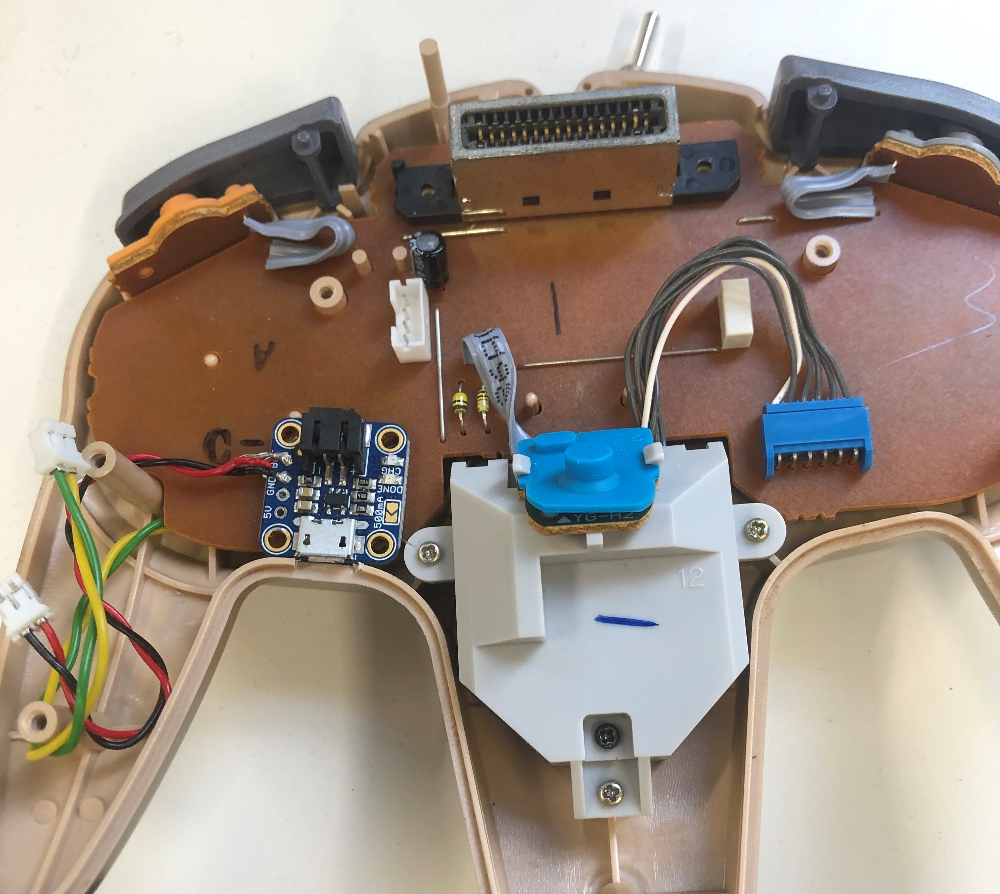
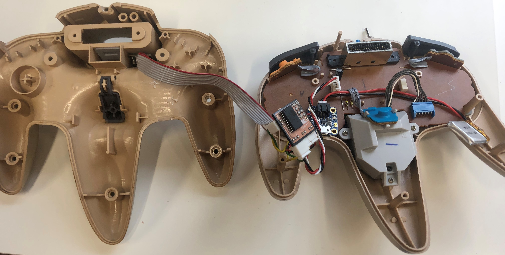

# N64 -Wireless Controller Mod
A modification to your current N64 controller to make it wireless. Based on the Work by micro on the [Universal Wireless Retro Controller](https://nfggames.com/forum2/index.php?topic=5180.0) Click the photo to see a video of the controller in action.

[!Youtube Tutorial Link (.../Extra/Images/Face.png)](http://www.youtube.com/shorts/WrgqsBNa95k)

### Notes
This project could use a lot of work, mainly:
1. We could integrate the NRF24L01+ into the PCB boards.
2. Add the components of the Micro-LiPo into the main transmitter PCB Board.
3. Translate the assembly code into Arduino code to allow the use of smaller micro controllers and possibly 2-way communication.

If you press the A button while powering the N64 controller with the mod, you will set the channel to A, while if you press B, you will set it to Channel B.

Know that if you decide to undertake this project, you are the one liable for any damages or risks that might occur.

## Getting Started
### Prerequisites
All the Components that are needed can be found in the bellow list:

Optionally you could use JST connectors, instead of soldering wires directly to the PCB. I used the PH series. 
you need to have an [ISP Arduino Programmer](https://docs.arduino.cc/built-in-examples/arduino-isp/ArduinoISP), or use any ISP programmer such as the [USBasp-Programmer](https://hobbycomponents.com/usb-interface/841-usbasp-avr-programmer-adaptor). 
Install and set up [avrdudess](https://avrdudess.software.informer.com/2.4/) There are tons of write-ups on how to do this. 
Print the Receiver's [3D box and Lid](https://github.com/saifsabban/N64-WirelessControllerMod/tree/master/3D-PrintableCase), and use two 2.5M screws to hold it down. 
Print the PCBs for the [Reciever with a SMD microcontroller](https://github.com/saifsabban/N64-WirelessControllerMod/blob/master/N64_Receiver/N64_Receiver_PCB/N64_RX_GerberV2.1.zip) or [Receiver with a DIP microcontroller](https://github.com/saifsabban/N64-WirelessControllerMod/blob/master/N64_Receiver/N64_Receiver_PCB/N64_RX_GerberV2.0.zip) & the [Transmitter](https://github.com/saifsabban/N64-WirelessControllerMod/blob/master/N64_Transmitter/N64_Transmitter_PCB/N64_Tx_V4.0_Gerber.zip)

## Making the Receiver
1. Populate the Receiver PCB with the appropriate parts (The essential resistors & capacitor can be either SMD or Through-Hole): 

2. Connect the ISP pins for your desired programmer to the Receiver Board. Hopefully this reference image and the PCB silkscreen will be of some help. 

3. Program the Board using AVRdudess with the same parameters shown, MAKE SURE THAT THE HIGH BYTE IS 0xDF & LOW BYTE IS 0xEE. If you don't then you might never be able to use that microcontroller again unless you change the crystal 

4. Solder some wire to the switch and solder the other side to the PCB board's SW connector (It doesn't matter which pole of the switch connects to which pad).
5. Cut the N64 plug from the controller, making sure you have some length to route & solder to, I usually keep amount 20cm of cable and cut as necessary.
6. Check the fit of the plug to the printed box, some 3D printers make the opening too large or too small.
7. Glue the Connector to the BOX.
8. Solder the Red wire to the + pad on the connector labelled N64, the black wire to the pad labelled - and the white wire to the pad in the middle of both + & -.
9. Attach (or solder) the NRF24L01+ board onto the Receiver PCB.
10. Place and glue all the parts inside the 3D printed box (As shown) and screw on the Lid 

## Making the Transmitters
1. Populate the Transmitter PCB with the appropriate parts: 

2. Connect the ISP pins for your desired programmer to the Transmitter Board. Hopefully this reference image will be of some help (the pins are in the same location as the connector on the Transmitter PCB, the Ground pin is the one that is highlighted) 

3. Program the Board using AVRdudess with the same parameters shown, MAKE SURE THAT THE HIGH BYTE IS 0xDF & LOW BYTE IS 0xDF. If you don't then you might never be able to use that microcontroller again unless you change the crystal 

4. Disassemble the N64 Controller.
5. Desolder the original blue connector that connects to the cable. (I would strongly advise soldering a JST 4 pin PH female connector as shown in the photo below) 

6. Check the Size of your switch as around 4.8mm, and proceed to drill a 5mm hole at the button half of the controller (See images), solder some wires to them and screw them onto the controller 

 

7. Solder some wires to the 5mm LED and hotglue it into the hole that the old controller wire used to come out of. (Keep a note which wire is positive and which is negative)  

8. route the wires switch and LED wires to the "Right Hand" area of the controller. 

9. Remove the 2 lower "Crosses" that brace the buttons, from the bottom half of the controller. 

10. solder wires to the "Bat" pin and the "GND" pin on the Adafruit Micro lipo.
11. Place the Micro lipo at the Right-hand side of the controller, and cut a bit off the corresponding top and bottom half edges to allow the USB charger through. 

 

12. Desolder the Pins on the NRF24L01+ and solder wires to each pin, remembering which wire corresponds to which pin. 

13. leave some length and solder the other side of the wires from step 11 to the Custom board. 

14. Solder the LED and Switch wires to the Main PCB, making sure the polarity of the LED wires are correct (- pin is Ground, + pin is 3.3V).
15. Solder the wires from the Micro lipo, to the Custom board's Bat pins, making sure that the Bat pin solders to the pin marked with a +.
16. Solder the wires From the N64 controller board to the custom board, Pin order is VCC (Denoted by the + sign on top), signal wire, and ground.  

17. Attach a battery to the micro lipo and test the mod. Remember if you press the A button while powering the N64 controller with the mod, you will set the channel to A, while if you press B, you will set it to Channel B.
18. If all works button up your device. I recommend routing the battery to the Left hand side of the controller, the custom board to the Right, and feeding the NRF24L01+ into the nook of the expantion slot. 

## Warnings!!
Make sure the polarity of the receiver pins is correct or you risk blowing the N64's power module, or worse, frying the N64 completely. In you connect the Batter pins or the N64 pins to the wrong wires you risk frying you N64 controller. I've tried this mod on reproduction N64 controllers, but it seems they allow some electrical noise that messes us the communication pathways and making it seem like you've pressed buttons you didn't actually press. If you mess with the power pins on the NRF24L01+ you risk breaking either your n64 or the controller, depending on which one was wrongfully connected. However, messing up the data pins of the NRF24L01+ breaks nothing. If the battery is too low, it will keep the LED light on, but might not send any control signals to the receiver.